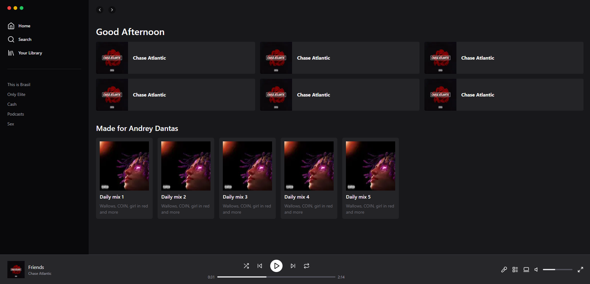

<h1 align="center">Clone Spotify</h1>

## 🔖Preview

<p align="center" >
	  
	</p>
  
## 📜 Sobre
<p>
Clone da página principal do Spotify.
</p>

Construído junto com o Diego no vídeo da [Rocketseat](https://www.youtube.com/watch?v=YVI-q3idGiM&ab_channel=Rocketseat)

## 🚀 Tecnologias

### Frontend:

- React
- Tailwind
- Nextjs
- Lucide-React
- Typescript

## 💻 Iniciando o Projeto

### Requisitos

**Clone o Projeto e acesse o Diretório**

```bash
$ git clone https://github.com/andreydantasvf/Spotify-Reactjs && cd Spotify-Reactjs
```

**Para iniciar a aplicação web:**

```bash
$ npm run dev
```

---

Feito por Andrey Dantas 👋 Siga minhas redes sociais:

- [Instagram](https://www.instagram.com/andreydantasvf/)
- [Twitter](https://twitter.com/andreydantasvf)
- [Linkedin](https://www.linkedin.com/in/andreydantasvf/)
